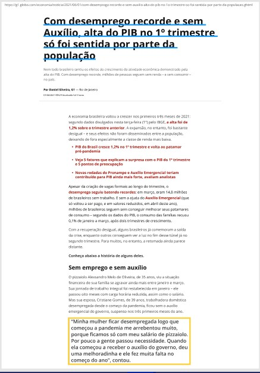

<h1>Copy of the G1 website</h1>

in the web authoring course we were instructed to reproduce a copy of an article from a news page

Only the HTML and CSS tools were used

Model for copy in figma: <a href = "https://www.figma.com/file/sX2FkOOqdVnwcQUscW6pz1/Página-G1?node-id=0%3A1"> Go to figma file</a>

